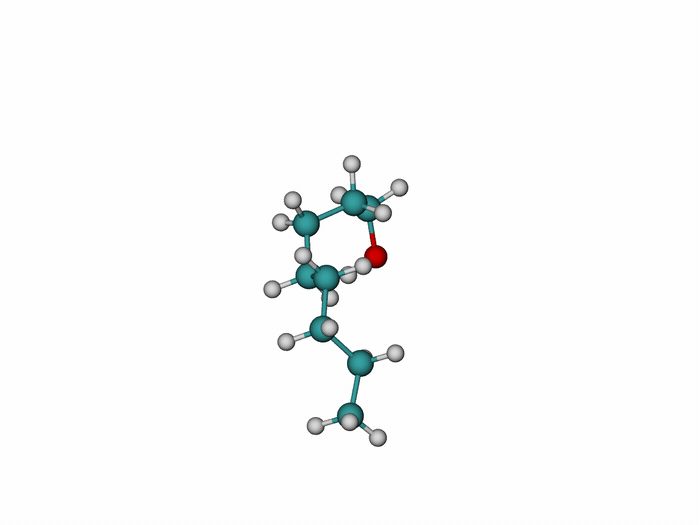
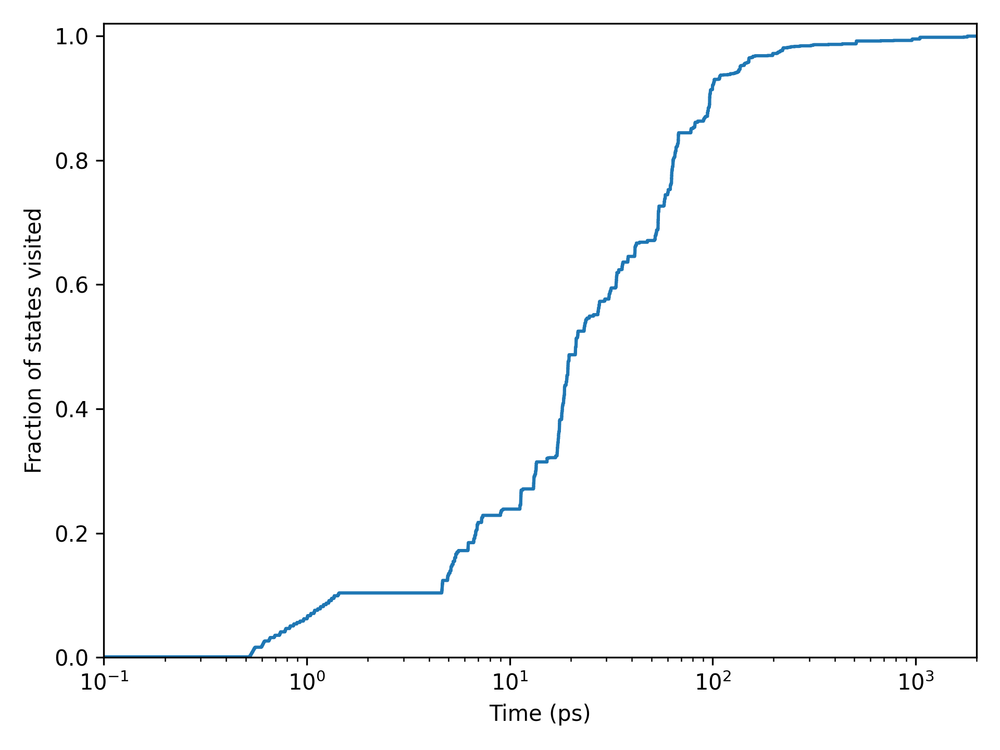

# MetaTally example: Octanol

This example demonstrates multi-dihedral sampling of octanol with MetaTally. Seven consecutive dihedral angles along the octanol chain, including the C–O–H torsion, are encoded into a single conformational state index, $\zeta$. Each PBMetaD component biases $\zeta$ together with one local torsion, $(\zeta,\phi_i)$.



*Octanol conformational exploration during a 2 ns MetaTally trajectory. Translation and rotation have been removed to make the internal torsional changes easier to see.*

## Multi-dihedral state encoding

The seven biased torsions are assigned three torsional states: gauche+, trans, and gauche−. For each torsion $\phi_i$, smooth switching functions $\xi_{g^+}^{(i)}$, $\xi_{\mathrm{t}}^{(i)}$, and $\xi_{g^-}^{(i)}$ describe membership of the torsion in each state. These state memberships are weighted as:

$$
\begin{aligned}
a_i(\phi_i) &=
0\cdot \xi_{g^+}^{(i)}(\phi_i)
+
1\cdot \xi_{\mathrm{t}}^{(i)}(\phi_i)
+
2\cdot \xi_{g^-}^{(i)}(\phi_i).
\end{aligned}
$$

The global state index $\zeta$ is then constructed from the seven torsional contributions using a ternary encoding:

$$
\begin{aligned}
\zeta(\phi_1,\phi_2,\ldots,\phi_7)
&=
3^0a_1(\phi_1)
+
3^1a_2(\phi_2)
+
3^2a_3(\phi_3)
+
\cdots
+
3^6a_7(\phi_7).
\end{aligned}
$$

This ternary encoding gives $3^7 = 2187$ possible encoded states.

Each PBMetaD component then biases a two-dimensional space defined by the global state index, $\zeta$, and one local torsion, $\phi_i$:

$$
\begin{aligned}
\mathrm{BIASARG}_1 &= (\zeta,\phi_1), \\
\mathrm{BIASARG}_2 &= (\zeta,\phi_2), \\
\mathrm{BIASARG}_3 &= (\zeta,\phi_3), \\
&\vdots \\
\mathrm{BIASARG}_7 &= (\zeta,\phi_7).
\end{aligned}
$$

## Contents

* `inputs/`: GROMACS and PLUMED input files for the octanol example.
* `scripts/`: analysis scripts for the COLVAR output.
* `reference/example_COLVAR`: small reference COLVAR file for testing the analysis scripts.
* `media/`: figures and animation generated from the full example trajectory.

## Run

Prepare and run the simulation with GROMACS and PLUMED:

```bash
gmx grompp -f inputs/md.mdp -c inputs/111-87-5.pdb -p inputs/111-87-5.top -o md.tpr
gmx mdrun -deffnm md -plumed inputs/plumed.dat
```

## Analyse

From a directory containing a `COLVAR` file:

```bash
python scripts/count_states.py COLVAR
python scripts/analyse_colvar.py COLVAR
```

## Example result

For a 2 ns octanol MetaTally trajectory using a Gaussian height of `0.1 kBT`, the simulation visited 2186 of 2187 encoded states. Approximately 97% of the encoded state space was visited within the first 0.2 ns.



**Figure 1.** Cumulative fraction of the seven-torsion ternary state space visited during the 2 ns octanol MetaTally trajectory.

## Notes

The included `reference/example_COLVAR` file is intended only to test the analysis scripts. It is not the full production output used to generate the example state coverage plot.

